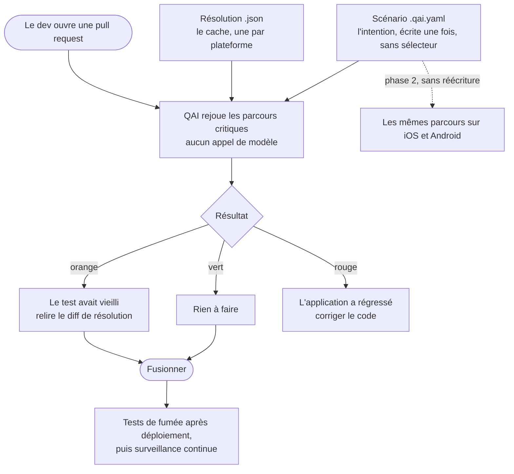

# QAI

Un agent QA qui s'insère dans la boucle de pull request pour dire aux équipes ce
que leur code — de plus en plus écrit par IA — vient de casser dans l'interface,
à partir de scénarios décrits en intentions plutôt qu'en sélecteurs, et donc
rejouables tels quels sur le web puis sur le mobile.

## Comment on s'en sert



Le développeur n'écrit jamais de sélecteur, ne maintient pas un test cassé par un
renommage, et ne tient pas une seconde suite pour le mobile.

## Pourquoi ce positionnement

Le marché du test agentique est encombré (~1,5 Md$ investis, 40+ acteurs) et un
concurrent financé occupe déjà le discours générique « langage naturel + tests
auto-réparants pour le web ». Deux choix nous en distinguent :

- **Le déclencheur.** On ne vend pas une plateforme de QA à une équipe QA qui
  souvent n'existe plus. On se branche sur la revue de pull request des équipes
  qui livrent avec des agents de code, là où la douleur est quotidienne et
  l'acheteur est le lead dev.
- **La portabilité.** Une équipe qui a une app web et une app mobile maintient
  aujourd'hui deux suites de tests séparées qui divergent. Personne ne vend
  « un scénario écrit une fois, rejoué sur les deux ». C'est faisable seulement
  si le format de test ne contient aucun sélecteur — d'où la contrainte
  d'architecture ci-dessous, qui n'est pas négociable.

## Les engagements d'architecture

1. **Un scénario ne contient jamais de sélecteur, de XPath ni de coordonnée.**
   Autoriser une échappatoire « pour les cas difficiles » suffirait à tuer la
   portabilité mobile en six mois.
2. **L'intention et sa résolution vivent dans des fichiers séparés.** Porter sur
   mobile = générer un fichier de résolution, pas réécrire les tests.
3. **L'exécution a trois étages** — rejeu déterministe (coût modèle nul, ~95 %
   des runs), réparation à l'échec, exploration agentique à la création. Les
   coûts d'inférence sont un enjeu de survie, pas une optimisation tardive.
4. **L'auto-réparation ne touche jamais aux assertions.** Elle peut changer
   *comment* on atteint un élément, jamais *ce qui est affirmé* sur lui. Sans
   cette règle, le produit apprend à faire passer les bugs.
5. **Un seul driver, plusieurs implémentations** — `observe()`, `resolve()`,
   `act()`, `settle()`. Playwright derrière le web, Appium/XCUITest/Espresso plus
   vision derrière le mobile. L'évaluation des assertions reste dans le moteur :
   déléguée aux drivers, elle divergerait entre web et mobile.

## Où regarder

| Chemin | Contenu |
|---|---|
| [docs/scenario-format.md](docs/scenario-format.md) | La spécification du format et ses justifications |
| [docs/driver.md](docs/driver.md) | Le contrat de plateforme et la correspondance des rôles web/iOS/Android |
| [docs/getting-started.md](docs/getting-started.md) | **Prise en main en cinq minutes, sur une boutique de démonstration** |
| [docs/engine.md](docs/engine.md) | Le moteur de rejeu, la frontière de sécurité, le rapport à trois états |
| [docs/modele.md](docs/modele.md) | Brancher son propre modèle et poser un plafond de dépense |
| [docs/couts.md](docs/couts.md) | Ce que ça coûte à faire tourner, sur des mesures réelles |
| [src/driver/types.ts](src/driver/types.ts) | Le contrat, seule source de vérité |
| [src/driver/web/](src/driver/web/) | Implémentation Playwright et sa suite de conformité |
| [src/engine/](src/engine/) | Rejeu, appariement, assertions, contrôle de cohérence |
| [examples/checkout-guest.qai.yaml](examples/checkout-guest.qai.yaml) | Un parcours critique portable web/mobile |
| [examples/.qai/resolutions/](examples/.qai/resolutions/) | Sa résolution web, vérifiée par les tests |
| [schema/scenario.schema.json](schema/scenario.schema.json) | Validation des scénarios |

## État d'avancement

| Pièce | Statut |
|---|---|
| Format de scénario et schéma | fait |
| Driver web (Playwright) | fait |
| Moteur de rejeu — étage 1 | fait |
| Assertions, captures, cohérence | fait |
| CLI (`run`, `check`) et rapport | fait |
| Contrat de modèle enfichable et plafond de dépense | fait |
| Étage 3, génération de résolutions | à faire |
| Étage 2, réparation | interface définie, implémentation à écrire |
| Intégration CI et commentaire de PR | à faire |
| Drivers mobiles | à faire |

```bash
npm install && npx playwright install chromium && npm test
```

Puis la démonstration complète, application saine puis cassée :
[docs/getting-started.md](docs/getting-started.md).

## Périmètre

Dans le périmètre : la régression fonctionnelle en pull request, les tests de
fumée après déploiement et la surveillance synthétique sur environnement livré.

Hors périmètre, délibérément : la recette utilisateur au sens propre. Un test de
régression a un oracle fiable — l'état connu comme bon la fois précédente. La
recette a pour oracle l'intention métier, qui n'existe de façon complète que
dans la tête d'un humain, et elle se termine par une signature engageant une
responsabilité. L'outil prépare la recette, la sécurise et **capture les
parcours validés pour les transformer en régression permanente** ; il ne
prononce pas l'acceptation.
